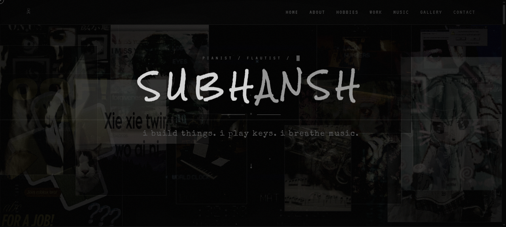
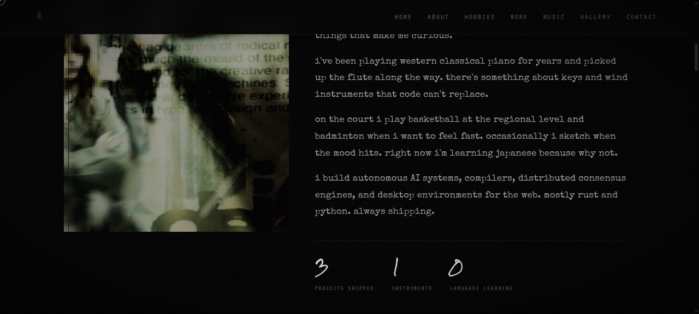

# SUBHANSH

a personal site built from scratch with html, css, and js. dark grunge/y2k/emo aesthetic. no frameworks, no libraries, just raw code.



## whats in it

### loading screen
when you open the site you get a piano key animation... 7 white bars that press down in sequence like keys being played, with "loading" blinking underneath. fades out after the page loads.

### custom cursor
the default cursor is hidden. theres a 20px hollow circle that follows your mouse directly and a 6px solid dot that trails behind it with a smooth lerp. when you hover over anything clickable the cursor scales up and glows blue. disabled on mobile.

### film grain + vignette
the whole page has a fixed film grain overlay that shifts position to look like actual film. plus a vignette that darkens the edges. gives everything that worn VHS tape feel.

### hero section
this is the densest part. 16 floating images covering the entire viewport, overlapping each other. each one shifts based on your mouse position using a parallax system (each image has a different depth value so they move at different speeds). every image is also draggable... you can grab them and throw them around. behind the name is a canvas running 60 particles that drift around and connect with faint lines when they get close. the name "SUBHANSH" has a VHS glitch effect that fires briefly every 8 seconds. each letter floats independently with staggered delays. the tagline types out character by character with a blinking cursor. the hero also has scanlines, a VHS tracking line that sweeps down the screen, and goth decorations (scratches, crosses, spider webs in corners, spiders) at low opacity.

### about section


the image has a 3D tilt effect that follows your cursor in perspective. it has an offset border that expands on hover and a scanline overlay. stat counters (5 projects shipped, 2 instruments, 1 language learning) animate up from 0 when they scroll into view.

### hobbies section
4 image windows scattered across the section. each one is draggable and has the tilt effect. below are 6 hobby descriptions in a grid (piano, flute, basketball, badminton, sketching, japanese). each card has a left border that glows blue on hover and shifts right.

### projects section
5 project rows linking to github repos (RUMI, Fabric, Friday, MewoOS, raft-rs). each row shifts left on hover with a gradient glow sweep and a 3D tilt effect. arrows fade in on hover. numbers (01-05) on the left.

### music section
a 24-bar visualizer that pulses at different speeds. 4 scattered image windows. a music quote. a mini piano that actually plays real notes through the Web Audio API... you can click the keys or use your keyboard (a s d f g h j k for white keys, w e t y u for black ones). triangle wave, accurate frequencies, keys visually depress when you press them. plus a spotify embed.

### gallery section
CSS grid layout with 8 images. each item has the tilt effect and labels that slide up from the bottom on hover (keys, stage, vibes, moment, flow, soul, space, sound).

### contact section
3 social cards (github, discord, email) with SVG icons. each card and nav link has a magnetic effect where the element physically follows your cursor before snapping back. below is a terminal that types out commands when it scrolls into view:

```
$ whoami
subhansh@dev ~/projects
always shipping. always curious.
```

### footer
a visitor counter stored in localStorage that increments each visit.

### section decorations
every section has goth dressings... crosses (✝ and ✖), thin diagonal scratch lines, faint blue stain dots, tiny 3px dot markers, spider webs drawn in CSS in all 4 corners, and one spider per section. all at 2-6% opacity so they read as background texture. thin gradient dividers between each section.

## responsive
- custom cursor hidden on mobile
- hamburger menu replaces nav links
- hero floating images reduced on smaller screens
- all goth decorations hidden on mobile
- grid layouts collapse to fewer columns
- hero side text hidden

## keyboard shortcuts

on the mini piano:
- white keys: `a` `s` `d` `f` `g` `h` `j` `k`
- black keys: `w` `e` `t` `y` `u`

## tech

- html + css + js, no dependencies
- custom properties for theming
- CSS grid and flexbox for layout
- CSS animations and transitions
- IntersectionObserver for scroll-triggered reveals
- Canvas API for the particle system
- Web Audio API for the piano
- requestAnimationFrame for smooth rendering

## repo

[github.com/subhansh-dev/near](https://github.com/subhansh-dev/near)
